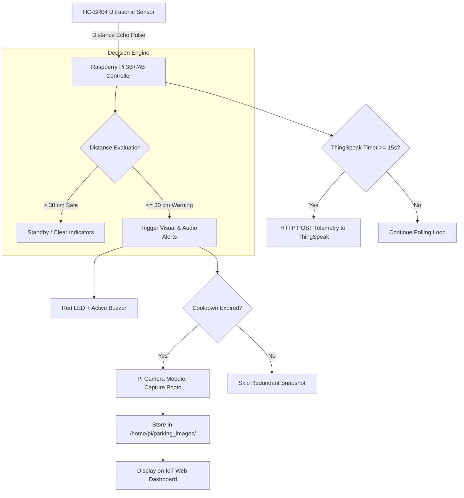
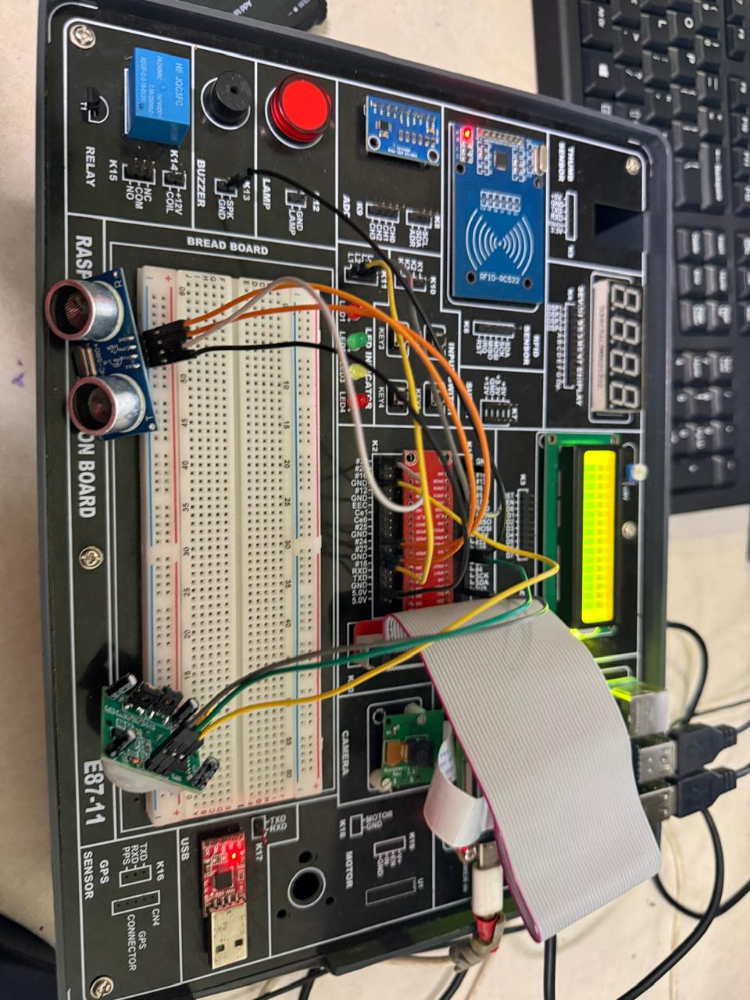
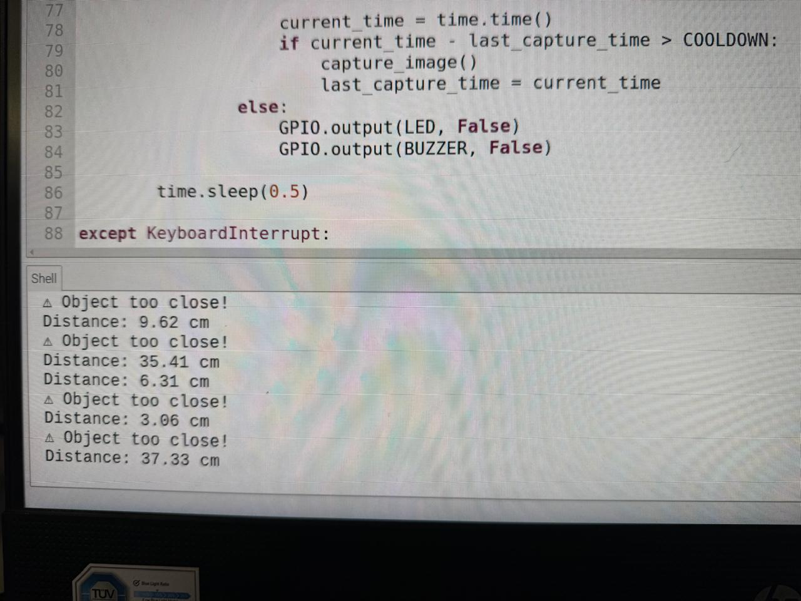
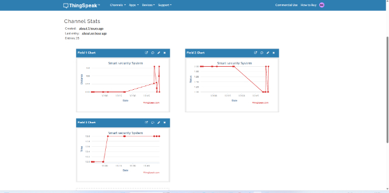
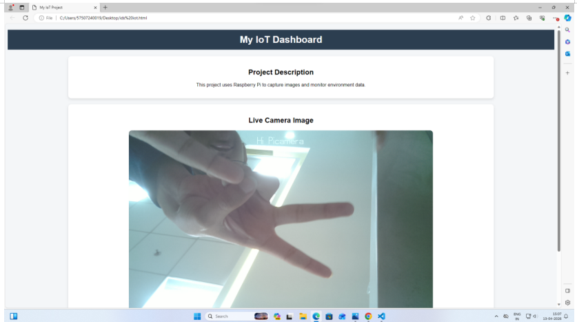

<div align="center">

# 🚗 ReverseSense-360
### **IoT-Based Smart Parking Safety & Near-Miss Forensic Capture System**

[](https://www.python.org/)
[](https://www.raspberrypi.com/)
[](https://thingspeak.com/)
[](https://opensource.org/licenses/MIT)
[](#)

*An intelligent, multi-sensory proximity warning and automated photographic evidence logging system designed to eliminate blind spots, prevent low-speed parking collisions, and provide verifiable cloud telemetry.*

---

[Key Features](#-key-features) •
[System Architecture](#-system-architecture) •
[Hardware Setup](#-hardware-setup--pinout) •
[Live Demonstration](#-live-demonstration--results) •
[Quickstart](#-quickstart-guide) •
[Contributors](#-project-contributors)

</div>

---

## 📌 Problem Overview

Urban parking accidents—including collisions with low-lying pillars, bollards, walls, and pedestrians—are responsible for frequent vehicle damage and disputed liability claims. Traditional reverse-parking sensors only produce simple beeps without recording the incident or providing visual confirmation.

**ReverseSense-360** bridges this gap by combining:
1. **Millisecond-level Ultrasonic Proximity Sensing** for immediate obstacle detection.
2. **Multi-Modal Warning Actuation** (visual LED indicators and audible buzzer alarms).
3. **Automated Incident Camera Snapshots** to preserve tamper-proof visual evidence of near-collisions.
4. **Cloud Telemetry & Web Dashboarding** on ThingSpeak and local web consoles for live remote monitoring.

---

## ✨ Key Features

- 📏 **Real-Time Distance Monitoring**: Emits 40 kHz ultrasonic pulses every 500 ms, calculating proximity with $\pm0.5\text{ cm}$ precision.
- 🚨 **Multi-Tiered Alerting System**:
  - **Safe Zone ($> 30\text{ cm}$)**: Normal scanning, indicators idle.
  - **Caution Zone ($10\text{ cm} - 30\text{ cm}$)**: Red LED active, audible buzzer alert triggered.
  - **Critical Danger Zone ($< 10\text{ cm}$)**: Continuous alarms and automated camera capture.
- 📸 **Forensic Image Capture**: Triggers the Raspberry Pi Camera Module to record timestamped photos (`incident_YYYYMMDD_HHMMSS.jpg`) on hazard detection with a built-in cooldown mechanism to prevent redundant frame spam.
- ☁️ **ThingSpeak IoT Cloud Logging**: Automatically publishes distance, binary hazard flags, and cumulative incident counts over Wi-Fi via REST API.
- 🖥️ **Lightweight Web Dashboard**: Responsive modern frontend to view live camera snapshots and system telemetry in real time.
- ⚡ **Ultra-Low Latency**: End-to-end response time under **$50\text{ ms}$** from detection to actuator triggering.

---

## 🏗️ System Architecture

The project operates on a synchronized **Sense → Process → Act → Communicate** pipeline:



---

## 🔌 Hardware Setup & Pinout

### Component Summary

| Component | Model / Spec | Purpose |
| :--- | :--- | :--- |
| **Microcomputer** | Raspberry Pi 3B+ / 4B | Central controller running control algorithms |
| **Ranging Sensor** | HC-SR04 Ultrasonic | Proximity measurement ($2\text{ cm} - 400\text{ cm}$) |
| **Camera Module** | Pi Camera V2 (CSI) | Captures forensic snapshots of obstacle |
| **Visual Indicator** | 5mm Red Diffused LED | Visual proximity warning |
| **Audio Indicator** | 5V Active Buzzer | High-pitch audible collision alarm |
| **Protection Circuit** | $1\text{ k}\Omega$ & $2\text{ k}\Omega$ Resistors | Voltage divider (5V to 3.3V GPIO safety) |

### GPIO Pin Connections (BCM Mode)

| Peripheral Pin | Raspberry Pi Header Pin | GPIO Pin | Notes |
| :--- | :--- | :--- | :--- |
| **HC-SR04 VCC** | Pin 2 | — | Direct +5V supply rail |
| **HC-SR04 GND** | Pin 6 | — | Shared Ground rail |
| **HC-SR04 TRIG** | Pin 16 | GPIO 23 | Digital Output (10 µs trigger pulse) |
| **HC-SR04 ECHO** | Pin 18 | GPIO 24 | Digital Input (**via 1k/2k voltage divider**) |
| **LED Anode (+)** | Pin 12 | GPIO 18 | Output through $330\,\Omega$ resistor |
| **Buzzer (+)** | Pin 11 | GPIO 17 | Output to active buzzer |
| **Camera** | CSI Ribbon Port | — | Direct MIPI-CSI interface |

> [!IMPORTANT]
> **Voltage Divider Protection**: The HC-SR04's `ECHO` pin outputs a $5\text{ V}$ signal. Because the Raspberry Pi GPIO is rated for **$3.3\text{ V}$ maximum**, a voltage divider ($1\text{ k}\Omega$ series resistor and $2\text{ k}\Omega$ pull-down resistor to GND) is required to safely step down the signal to $3.33\text{ V}$.

---

## 📸 Live Demonstration & Results

<div align="center">

### 1. Hardware Laboratory Assembly


*Assembled on Raspberry Pi IoT Development Platform (E87-11) with ultrasonic sensor, Pi camera ribbon, and alert LEDs.*

---

### 2. Live Execution & Shell Telemetry


*Real-time distance polling in Thonny IDE. When proximity dropped to 9.62 cm, 6.31 cm, and 3.06 cm, alerts triggered instantly.*

---

### 3. ThingSpeak Cloud Analytics Dashboard


*Continuous cloud telemetric monitoring: Field 1 (Distance), Field 2 (Binary Alert Flag), and Field 3 (Cumulative Incident Count).*

---

### 4. Incident Web Dashboard Preview


*Live local web dashboard displaying system operational status and automatically fetched obstacle snapshots.*

</div>

---

## 📊 Experimental Results & Validation

Over **25 recorded laboratory test trials** at distances ranging from $3\text{ cm}$ to $100\text{ cm}$:

| Proximity Range | Visual LED | Audio Buzzer | Camera Action | ThingSpeak Telemetry |
| :---: | :---: | :---: | :---: | :---: |
| **$< 10\text{ cm}$ (Hazard)** | **ON (Red)** | **ON (Continuous)** | **Captures Timestamped Photo** | `Alert = 1`, Count Increment |
| **$10 - 30\text{ cm}$ (Warning)** | **ON (Red)** | **ON** | **Cooldown Check (5s)** | `Alert = 1` |
| **$> 30\text{ cm}$ (Safe)** | **OFF** | **OFF** | **Idle** | `Alert = 0` |

- **Measurement Accuracy**: $\pm0.5\text{ cm}$ verified against manual tape calibration.
- **Alert Latency**: $< 50\text{ ms}$ from obstacle crossing threshold to buzzer/LED actuation.
- **Cloud Upload Reliability**: **100%** over 25 consecutive transmission cycles.

---

## 🚀 Quickstart Guide

### 1. Prerequisites
- Raspberry Pi (3B+, 4B, or Zero 2W) running Raspberry Pi OS (Bookworm or Bullseye).
- Python 3.9+ installed with `pip`.
- Camera enabled via `sudo raspi-config` (`Interface Options -> Camera`).

### 2. Clone the Repository
```bash
git clone https://github.com/ayushbarve9/ReverseSense-360.git
cd ReverseSense-360
```

### 3. Install Dependencies
```bash
pip install -r requirements.txt
```

### 4. Configure ThingSpeak (Optional)
Export your ThingSpeak Write API Key as an environment variable (or edit `THINGSPEAK_API_KEY` in `src/main.py`):
```bash
export THINGSPEAK_API_KEY="YOUR_ACTUAL_WRITE_API_KEY"
```

### 5. Run the Controller
```bash
python3 src/main.py
```

### 6. View the Dashboard
Simply open `src/dashboard/index.html` in any web browser to view the incident feed and status layout.

---

## 📁 Repository Structure

```
ReverseSense-360/
├── README.md                      # Complete project documentation & guide
├── LICENSE                        # MIT Open-Source License
├── requirements.txt               # Python package dependencies
├── .gitignore                     # Git ignore rules for builds, logs & credentials
│
├── src/                           # System source code
│   ├── main.py                    # Core sensing, alerting & telemetry controller
│   └── dashboard/                 # Web monitoring dashboard
│       ├── index.html             # Responsive dashboard layout
│       └── style.css              # Custom styling & animations
│
├── docs/                          # Academic papers and schematics
│   ├── IoT_Smart_Parking_Safety_Report.pdf   # Complete institutional project report
│   ├── IoT_Smart_Parking_Safety_Report.docx  # Editable report manuscript
│   ├── hardware_specifications.md            # Electrical pinouts & voltage divider guide
│   └── experiment_case_study_format.pdf      # Lab syllabus reference template
│
└── assets/                        # High-resolution demonstration media
    ├── hardware_assembly.jpg      # Lab hardware assembly photograph
    ├── thonny_execution_output.jpg# Shell output execution screenshot
    ├── thingspeak_analytics.png   # ThingSpeak telemetry graph screenshot
    └── web_dashboard_preview.png  # IoT web interface screenshot
```

---

## 👥 Project Contributors

Developed as part of the **Internet of Things (IoT)** curriculum at **SVKM's Shri Bhagubhai Mafatlal Polytechnic**, Department of Computer Engineering (Academic Year 2026–2027):

- **Ayush Barve** (B066) – *Project Lead, Hardware Interfacing & Firmware*
- **Arif Choudhary** (B065)
- **Vivaan Shah** (B057)
- **Jaival Prajapati** (B064)
- **Rushabh Pandya** (B039)
- **Aditya Shah** (B050)

---

## 📜 License
This project is open-source and licensed under the [MIT License](LICENSE).
